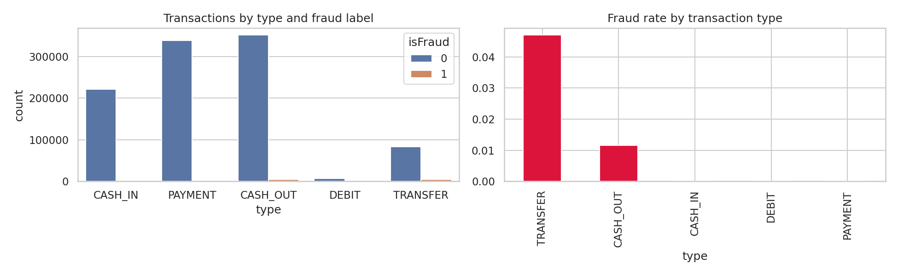
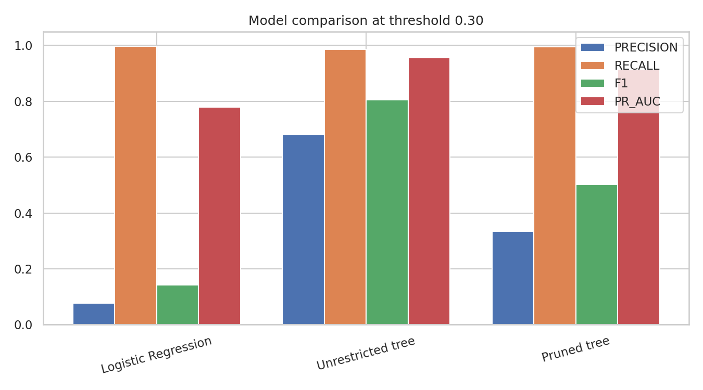
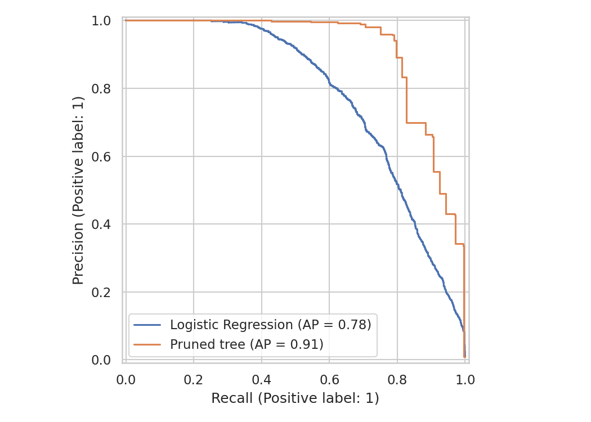

# From Brute Force to Optimization: Fraud Detection with PaySim

I started my fraud-detection capstone with a simple question:

> Can a model distinguish fraudulent transactions from legitimate ones?

The first version was intentionally simple. I loaded the PaySim data, encoded the transaction type, and trained Logistic Regression as a baseline.

That gave me a starting point—but not a final solution.

## Step 1: Start with a baseline

Logistic Regression provided:

- Fraud probabilities through `predict_proba()`
- An interpretable model using feature coefficients
- A measurable baseline for comparison
- A way to study the impact of the classification threshold

The default threshold of `0.50` was not automatically the right choice. Lowering the threshold could identify more fraudulent transactions, but it could also increase false positives.

That exposed the real modeling problem:

> Fraud detection is not only about accuracy. It is about balancing missed fraud against unnecessary declines or reviews.

## Step 2: Compare regularization

I compared L1 and L2 regularization.

- L1 can reduce some coefficients to zero.
- L2 shrinks coefficients more smoothly.
- The `C` parameter controls the strength of regularization.

This was the first optimization step: control model behavior instead of accepting default settings.

## Step 3: Test a nonlinear model

Next, I trained a Decision Tree using entropy.

Unlike Logistic Regression, a tree can represent rules and feature interactions such as:

```text
IF transaction type is TRANSFER
AND amount is high
AND balance behavior is unusual
THEN fraud risk may be high
```

The unrestricted tree performed very well on the training data—but that raised a concern.

Was it learning fraud patterns, or memorizing the training examples?

## Step 4: Identify overfitting

I compared training and validation performance.

The important question was not:

> Which model has the highest training accuracy?

It was:

> Which model performs reliably on data it has not seen before?

This changed the direction of the work. The goal was no longer to make the tree larger. The goal was to find the right level of complexity.

## Step 5: Optimize with pruning

Using scikit-learn’s `cost_complexity_pruning_path()`, I generated candidate `ccp_alpha` values.

As `ccp_alpha` increases:

- More branches are removed.
- Tree depth decreases.
- The number of leaves decreases.
- The risk of memorization can decrease.

I trained multiple trees and compared their validation precision, recall, F1 score, and PR-AUC.

This made the optimization process visible:

```text
Unrestricted tree
        ↓
Detect overfitting
        ↓
Generate pruning candidates
        ↓
Compare validation performance
        ↓
Select the best complexity
```

## The main lesson

The Decision Tree did not automatically replace Logistic Regression.

Logistic Regression provided the interpretable baseline. The Decision Tree tested whether nonlinear interactions added value. Pruning tested whether that additional complexity improved generalization.

The final model should be selected using the business objective:

- Recall: How much fraud did we catch?
- Precision: How many flagged transactions were actually fraud?
- F1: How well did precision and recall balance?
- PR-AUC: How well did the model rank fraud when fraud is rare?
- False positives: How many legitimate customers were affected?

The progression was:

```text
Brute-force baseline
        ↓
Probability and threshold analysis
        ↓
Regularization
        ↓
Nonlinear Decision Tree
        ↓
Overfitting diagnosis
        ↓
Cost-complexity pruning
        ↓
Business-focused model selection
```

The most valuable result was not simply a model score. It was seeing how a basic solution becomes more reliable through measurement, diagnosis, and optimization.

## Results from the PaySim experiment

The dataset contained 6,362,620 transactions, including 8,213 fraudulent transactions. Because the fraud class was highly imbalanced, I used a stratified working sample of 1,008,213 transactions: all 8,213 fraud cases and 1,000,000 legitimate transactions.

At a fraud-risk threshold of `0.30`:

| Model | Threshold | Precision | Recall | F1 | ROC-AUC | PR-AUC | Log loss |
|---|---:|---:|---:|---:|---:|---:|---:|
| Logistic Regression | 0.30 | 0.0764 | 0.9976 | 0.1419 | 0.9936 | 0.7790 | 0.1123 |
| Unrestricted Tree | 0.30 | 0.6811 | 0.9854 | 0.8055 | 0.9925 | 0.9565 | 0.0192 |
| Pruned Tree | 0.30 | 0.3348 | 0.9951 | 0.5011 | 0.9967 | 0.9128 | 0.0401 |

The Logistic Regression model caught almost all fraud cases, but its precision was only `7.6%`. That means many legitimate transactions would also be flagged.

The unrestricted tree improved precision to `68.1%` and achieved an F1 score of `0.805`, but its complexity created a higher overfitting risk.

The pruned tree reduced complexity while retaining `99.5%` recall and `0.913` PR-AUC. Its precision was lower than the unrestricted tree, but the model provided a more controlled complexity/performance trade-off.

The result changed the conversation from:

> Which model has the highest score?

to:

> Which model gives the right balance between caught fraud, false positives, and model complexity?

The plots and metrics are available with the notebook outputs. These numbers are from a working sample and should be confirmed with a full, temporal validation before making a production decision.

## Visual results

### Dataset distribution and fraud rate



### Model metric comparison



### Precision-recall comparison



## What the numbers show

- Logistic Regression reached `99.76%` recall, but precision was only `7.64%`.
- The unrestricted tree reached `68.11%` precision and `98.54%` recall.
- The unrestricted tree produced the highest F1 score: `0.8055`.
- The unrestricted tree also produced the highest PR-AUC: `0.9565`.
- The pruned tree retained `99.51%` recall while reducing model complexity.
- The pruned tree achieved `0.9128` PR-AUC and `0.5011` F1.
- Log loss was lowest for the unrestricted tree at `0.0192` in this experiment.

These results show the trade-off clearly: the Logistic Regression baseline catches more fraud but creates many false positives, while the tree models provide a stronger precision/recall balance on this working sample.

#MachineLearning #FraudDetection #Python #ScikitLearn #DataScience #ModelOptimization
